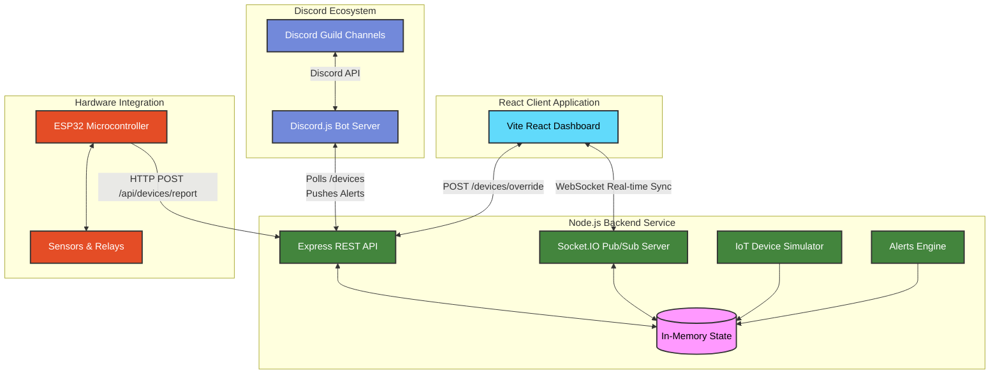

# The-LFD System Architecture

This diagram illustrates the full, event-driven microservices architecture of the **Lights, Fans, Discord (LFD)** platform. It shows how the Frontend, Backend, Discord Bot, and physical Hardware (ESP32) integrate in real-time.

## Key Components:

1. **React Client**: Renders the spatial SVG dashboard and receives real-time state updates via WebSockets. Sends manual override commands via REST.
2. **Node.js Backend**: The central source of truth. It holds the in-memory state, runs the background anomaly detection (Alerts Engine), and broadcasts changes to all connected clients.
3. **Discord Bot**: Runs independently, polling the backend for alerts and anomalies, and pushing notifications directly to the Discord channel.
4. **Hardware (ESP32)**: The physical layer that reads sensor data (INA219) and controls relays, reporting its status periodically to the backend via HTTP POST requests.
