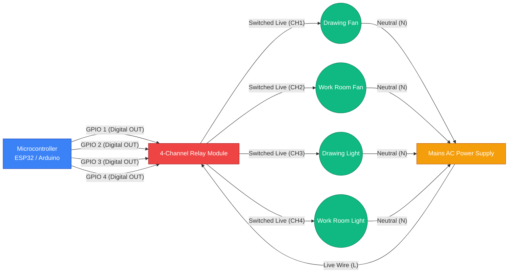

# Hardware Circuit Schematic

This document outlines the high-level physical hardware setup for the Lights, Fans, Discord (LFD) project, representing how the backend interfaces with physical IoT components.

## Relay Control Logic

### Components List
1. **Microcontroller**: An ESP32 or Arduino board that receives commands from the Node.js backend (via Serial, MQTT, or HTTP).
2. **Relay Module**: A standard 5V multi-channel relay module. The MCU uses 3.3V/5V logic to trigger the optocouplers on the relay board.
3. **Mains Power**: 120V/240V AC supply. **(Warning: Ensure proper isolation and safety protocols when working with mains voltage).**
4. **Appliances**: The physical ceiling fans and light bulbs representing the office fixtures.

### Data Flow
1. User clicks the "Toggle" switch on the React Dashboard.
2. Dashboard sends a `POST /devices/override` request to the Node.js backend.
3. Backend updates the database state and emits a command to the ESP32 (e.g., via a connected Serial port or local Wi-Fi API).
4. The ESP32 pulls the corresponding GPIO pin HIGH or LOW.
5. The Relay clicks, closing or opening the circuit for that specific appliance.
